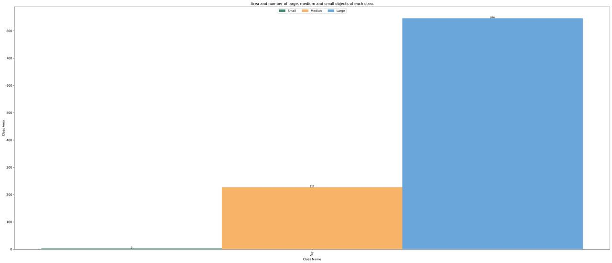
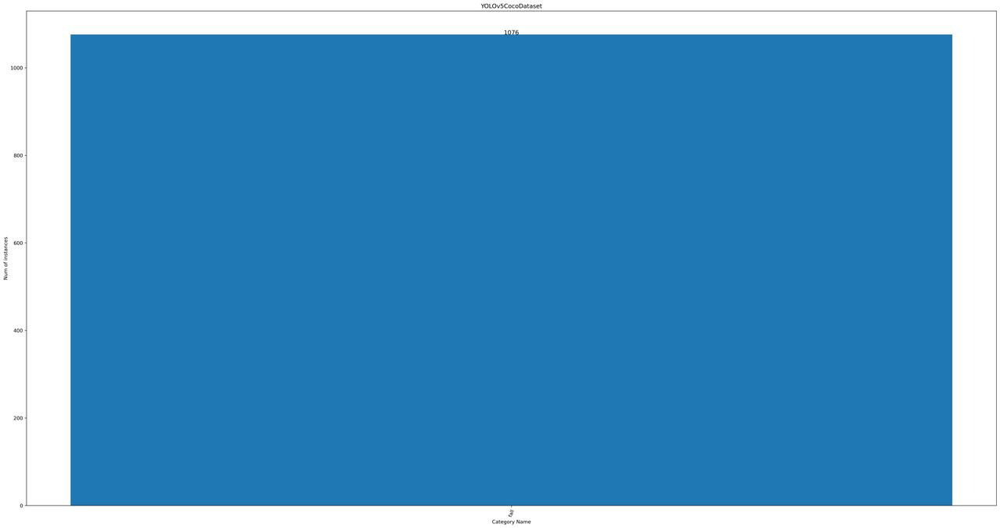
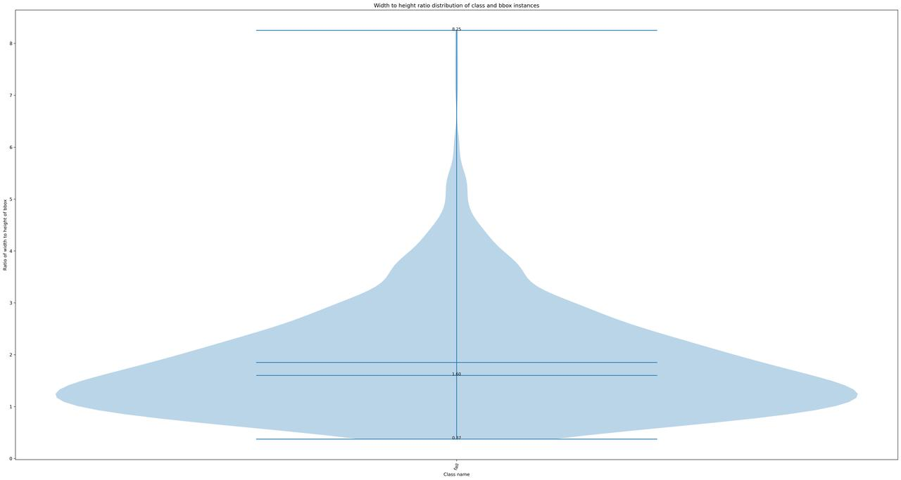
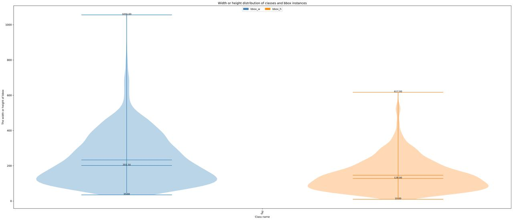
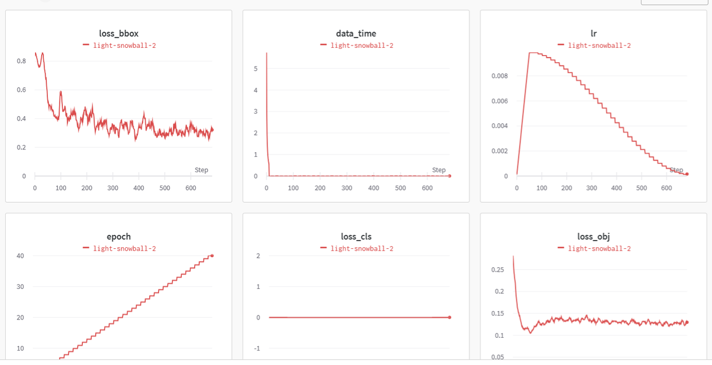
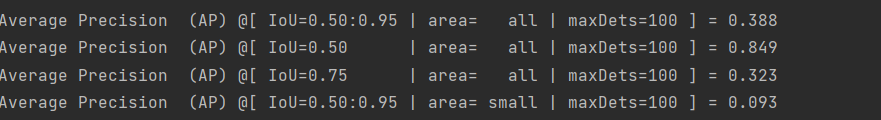
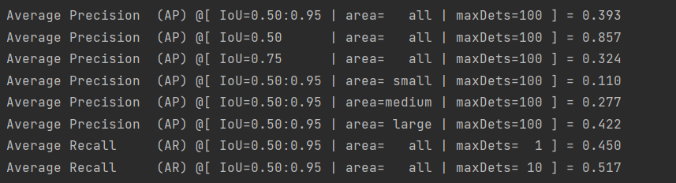

# 行人跌倒检测及jetson的部署
## 0、项目介绍

本项目选用轻量且高效的YOLOv7_tiny算法实现了对目标检测模型的微调，功能测试，以及在NVIDIA Jetson 平台上的部署和速度测试。实验表明：(1) 微调后的模型精度有明显提升，(2) [MMDeploy](https://github.com/open-mmlab/mmdeploy)转化后的tensorrt格式的目标检测模型几乎没有精度损失，且有较快的推理速度。

- 项目任务详情： [点击](https://github.com/open-mmlab/OpenMMLabCamp/discussions/562)
- Github 仓库链接： [点击](https://github.com/jiongjiongli/mmdet_jetson)

## 1、数据集分析
本项目收集1440张行人跌倒图像，并将数据集按训练集：验证集=8:2的比例进行划分
### 1.1首先从Github下载mmyolo项目
    git clone https://github.com/open-mmlab/mmyolo.git

### 1.2将yolov7_tiny_fall.py 放configs同一目录下
#### yolov7_tiny_fall.py 

    _base_ = 'yolov7_tiny_syncbn_fast_8x16b-300e_coco.py'
    
    data_root = r'H:/mmyolo-main/data/fall/' #数据集位置
    class_name = ('fall', )#类别名称
    num_classes = len(class_name)
    metainfo = dict(classes=class_name, palette=[(20, 220, 60)])
    
    anchors = [
        [(68, 69), (154, 91), (143, 162)],  # P3/8
        [(242, 160), (189, 287), (391, 207)],  # P4/16
        [(353, 337), (539, 341), (443, 432)]  # P5/32
    ]

    max_epochs = 40
    train_batch_size_per_gpu = 12
    train_num_workers = 4
    
    load_from = 'https://download.openmmlab.com/mmyolo/v0/yolov7/yolov7_tiny_syncbn_fast_8x16b-300e_coco/yolov7_tiny_syncbn_fast_8x16b-300e_coco_20221126_102719-0ee5bbdf.pth'  # noqa
    
    model = dict(
        backbone=dict(frozen_stages=4),
        bbox_head=dict(
            head_module=dict(num_classes=num_classes),
            prior_generator=dict(base_sizes=anchors)))
    
    train_dataloader = dict(
        batch_size=train_batch_size_per_gpu,
        num_workers=train_num_workers,
        dataset=dict(
            data_root=data_root,
            metainfo=metainfo,
            ann_file='annotations/trainval.json',
            data_prefix=dict(img='images/')))
    
    val_dataloader = dict(
        dataset=dict(
            metainfo=metainfo,
            data_root=data_root,
            ann_file='annotations/test.json',
            data_prefix=dict(img='images/')))
    
    test_dataloader = val_dataloader
    
    _base_.optim_wrapper.optimizer.batch_size_per_gpu = train_batch_size_per_gpu
    
    val_evaluator = dict(ann_file=data_root + 'annotations/test.json')
    test_evaluator = val_evaluator
    
    default_hooks = dict(
        checkpoint=dict(interval=10, max_keep_ckpts=2, save_best='auto'),
        # The warmup_mim_iter parameter is critical.
        # The default value is 1000 which is not suitable for cat datasets.
        param_scheduler=dict(max_epochs=max_epochs, warmup_mim_iter=10),
        logger=dict(type='LoggerHook', interval=5))
    train_cfg = dict(max_epochs=max_epochs, val_interval=10)
    visualizer = dict(vis_backends = [dict(type='LocalVisBackend'), dict(type='WandbVisBackend')]) # noqa

### 1.3查看训练集
    cd mmyolo-main
    python tools/analysis_tools/dataset_analysis.py configs/yolov7/yolov7_tiny_fall.py \
                       --out-dir work_dirs/dataset_analysis_cat/train_dataset

### 1.4查看验证集
    python tools/analysis_tools/dataset_analysis.py configs/yolov7/yolov7_tiny_fall.py --out-dir work_dirs/dataset_analysis_cat/train_datasetataset --val-dataset

### 1.5优化anchor尺寸
由于YOLOv7的anchor默认anchor尺寸是根据coco数据集得来的，本项目应根据本项目数据集计算anchor尺寸
#### 1.5.1
    python tools/analysis_tools/optimize_anchors.py configs/yolov7/yolov7_tiny_fall  
            --algorithm v5-k-means  
            --input-shape 640 640  
            --prior-match-thr 4.0 
            --out-dir work_dirs/dataset_analysis_fall
#### 1.5.2修改config中anchor变量
    anchors = [
     [(138, 83), (152, 161), (269, 94)],
     [(269, 168), (214, 265), (459, 154)], 
     [(363, 283), (486, 229), (498, 345)]
             ]

## 2、训练数据
### 本项目选用的算法为yolov7_tiny轻量型网络，具有快速检测的能力。
    python tools/train.py configs/yolov7/yolov7_tiny_fall.py
### 训练可视化具体如下，本项目训练100个epoch后，网络基本收敛

## 3、验证
### 3.1用训练好的模型对验证集进行验证

    python tools/test.py configs/yolov7/yolov7_tiny_fall.py work_dirs/yolov7_tiny_fall/best_coco_bbox_mAP_epoch_40.pth                 
### 3.2nms参数的调整
#### 3.2.0对yolov7_l_syncbn_fast_8x16b-300e_coco.py配置文件中nms进行修改
    model_test_cfg = dict(
    # The config of multi-label for multi-class prediction.
    multi_label=True,
    # The number of boxes before NMS.
    nms_pre=30000,
    score_thr=0.001,  # Threshold to filter out boxes.
    nms=dict(type='nms', iou_threshold=0.50),  # NMS type and threshold
    max_per_img=300)
#### 3.2.1nms取值对map的影响
    nms=0.4时，map0.5=84.9

    nms=0.45时，map0.5为85.7

    
    nms=0.48时，map0.5=0.859
    nms=0.50时，map0.5=0.87
当nms参数为0.5时，map0.5的指标最高，故调整nms的iou_threshold=0.50

## 4、导出模型
### 4.1#首先下载mmdeploy
    git clone https://github.com/open-mmlab/mmdeploy.git
### 4.2#进入mmdeploy-main文件
    cd mmyolo-main
### 4.3#导出onnxruntime模型
    python tools/deploy.py H:\mmyolo-main\configs\deploy\detection_onnxruntime_static.py H:\mmyolo-main\configs\deploy\model\yolov7_s-static.py configs/yolov7/best_coco_bbox_mAP_epoch_240.pth data/fall_7.jpg --dump-info#导出SDK
### 4.4#导出tensorrt模型
    python tools/deploy.py H:\mmyolo-main\configs\deploy\detection_tensorrt-int8_static-640x640.py H:\mmyolo-main\configs\deploy\model\yolov7_s-static.py configs/yolov7/best_coco_bbox_mAP_epoch_240.pth data/fall_7.jpg --dump-info#导出SDK

## 5、测速

### 5.1在Seeed Jetson Orin导出的onnxruntime文件进行测速测速

#### 5.1.1生成的日志文件如下：
    ========== onnxruntime-cuda ==========
    onnxruntime version 1.12.1
    options
      num_threads:2
      optimizition_level:enable_all
    execution_model:sequential
    inputs description
    input:[1, 3, 320, 320]
    outputs description
    dets:[1, 'Gatherdets_dim_1', 5]
    labels:[1, 'Gatherlabels_dim_1']
    input shape:(1, 3, 320, 320)
    loop count:20
    timecost: 64.38ms
    ========== megpeak cpu perf ==========
    there are 12 cores, currently use core id :0
    Vendor is: ARM, uArch: unknown, frequency: 0Hz
    
    bandwidth: 18.958020 Gbps
    nop throughput: 0.046433 ns 21.536610 GFlops latency: 0.060893 ns :
    ldd throughput: 0.152348 ns 13.127861 GFlops latency: 0.152118 ns :
    ldq throughput: 0.152234 ns 26.275372 GFlops latency: 0.152112 ns :
    stq throughput: 0.229189 ns 17.452873 GFlops latency: 0.229173 ns :
    ldpq throughput: 0.304489 ns 26.273569 GFlops latency: 0.304341 ns :
    lddx2 throughput: 0.228379 ns 17.514774 GFlops latency: 0.230601 ns :
    ld1q throughput: 0.152236 ns 26.275038 GFlops latency: 0.152116 ns :
    eor throughput: 0.228299 ns 17.520906 GFlops latency: 0.913028 ns :
    fmla throughput: 0.228263 ns 35.047352 GFlops latency: 1.830289 ns :
    fmlad throughput: 0.228303 ns 17.520605 GFlops latency: 1.827763 ns :
    fmla_x2 throughput: 0.467541 ns 34.221565 GFlops latency: 3.675978 ns :
    mla throughput: 0.456499 ns 17.524673 GFlops latency: 1.829411 ns :
    fmul throughput: 0.228291 ns 17.521524 GFlops latency: 1.371082 ns :
    mul throughput: 0.456715 ns 8.758192 GFlops latency: 1.841269 ns :
    addp throughput: 0.228363 ns 17.516001 GFlops latency: 0.915103 ns :
    sadalp throughput: 0.456589 ns 8.760610 GFlops latency: 1.828035 ns :
    add throughput: 0.228125 ns 17.534275 GFlops latency: 0.914881 ns :
    fadd throughput: 0.228245 ns 17.525057 GFlops latency: 0.912938 ns :
    smull throughput: 0.456355 ns 8.765101 GFlops latency: 1.833639 ns :
    smlal_4b throughput: 0.458533 ns 17.446936 GFlops latency: 1.840173 ns :
    smlal_8b throughput: 0.480294 ns 33.312958 GFlops latency: 1.850761 ns :
    dupd_lane_s8 throughput: 0.228325 ns 35.037834 GFlops latency: 0.915127 ns :
    mlaq_lane_s16 throughput: 0.456507 ns 35.048782 GFlops latency: 1.830033 ns :
    sshll throughput: 0.456441 ns 17.526899 GFlops latency: 0.912775 ns :
    tbl throughput: 0.228233 ns 70.103912 GFlops latency: 0.915910 ns :
    ins throughput: 0.456479 ns 4.381360 GFlops latency: 1.115577 ns :
    sqrdmulh throughput: 0.472065 ns 8.473401 GFlops latency: 1.866842 ns :
    usubl throughput: 0.230361 ns 17.364079 GFlops latency: 0.915229 ns :
    abs throughput: 0.228223 ns 17.526747 GFlops latency: 0.912941 ns :
    fcvtzs throughput: 0.914873 ns 4.372194 GFlops latency: 1.827603 ns :
    scvtf throughput: 0.915296 ns 4.370169 GFlops latency: 1.828205 ns :
    fcvtns throughput: 0.947023 ns 4.223763 GFlops latency: 1.830869 ns :
    fcvtms throughput: 0.913081 ns 4.380774 GFlops latency: 1.827703 ns :
    fcvtps throughput: 0.914997 ns 4.371601 GFlops latency: 1.827285 ns :
    fcvtas throughput: 0.913522 ns 4.378655 GFlops latency: 1.867723 ns :
    fcvtn throughput: 0.916999 ns 4.362057 GFlops latency: 1.827859 ns :
    fcvtl throughput: 0.912731 ns 4.382454 GFlops latency: 1.827561 ns :
    prefetch_very_long throughput: 13.660245 ns 0.292821 GFlops latency: 0.152268 ns :
    ins_ldd throughput: 0.464063 ns 4.309762 GFlops latency: 0.456615 ns :Test ldd ins dual issue
    ldd_ldx_ins throughput: 1.104095 ns 3.622878 GFlops latency: 0.456455 ns :
    ldqstq throughput: 2.922742 ns 1.368578 GFlops latency: 2.899029 ns :Test ldq stq dual issue
    ldq_fmlaq throughput: 0.228327 ns 35.037525 GFlops latency: 0.228165 ns :
    stq_fmlaq_lane throughput: 0.304502 ns 26.272392 GFlops latency: 2.284634 ns :Test stq fmlaq_lane dual issue
    ldd_fmlad throughput: 0.228167 ns 17.531048 GFlops latency: 0.228341 ns :Test ldd fmlad dual issue
    ldq_fmlaq_sep throughput: 0.228325 ns 35.037762 GFlops latency: 1.827905 ns :Test throughput ldq + 2 x fmlaq
    ldq_fmlaq_lane_sep throughput: 0.237275 ns 33.716118 GFlops latency: 2.300703 ns :Test compute throughput ldq + 2 x fmlaq_lane
    ldd_fmlaq_sep throughput: 0.228333 ns 35.036613 GFlops latency: 1.827823 ns :Test compute throughput ldq + fmlaq
    lds_fmlaq_lane_sep throughput: 0.228303 ns 35.041210 GFlops latency: 2.287084 ns :
    ldd_fmlaq_lane_sep throughput: 0.228359 ns 35.032616 GFlops latency: 2.318689 ns :Test compute throughput ldd + fmlaq_lane
    ldx_fmlaq_lane_sep throughput: 0.228353 ns 35.033539 GFlops latency: 2.332591 ns :
    ldd_ldx_ins_fmlaq_lane_sep throughput: 0.379272 ns 21.093048 GFlops latency: 2.287856 ns :Test compute throughput ldd+fmlaq+ldx+fmlaq+ins+fmlaq
    ldd_nop_ldx_ins_fmlaq_lane_sep throughput: 0.343434 ns 23.294142 GFlops latency: 2.286804 ns :
    ins_fmlaq_lane_1_4_sep throughput: 0.405852 ns 19.711609 GFlops latency: 3.760201 ns :Test compute throughput ins + 4 x fmlaq_lane
    ldd_fmlaq_lane_1_4_sep throughput: 0.243628 ns 32.836971 GFlops latency: 2.287016 ns :Test compute throughput ldd + 4 x fmlaq_lane
    ldq_fmlaq_lane_1_4_sep throughput: 0.228340 ns 35.035461 GFlops latency: 0.228173 ns :Test compute throughput ldq + 4 x fmlaq_lane
    ins_fmlaq_lane_1_3_sep throughput: 0.404522 ns 19.776428 GFlops latency: 3.767939 ns :Test compute throughput ins + 3 x fmlaq_lane
    ldd_fmlaq_lane_1_3_sep throughput: 0.384988 ns 20.779846 GFlops latency: 3.738999 ns :
    ldq_fmlaq_lane_1_3_sep throughput: 0.228464 ns 35.016472 GFlops latency: 0.230189 ns :Test compute throughput ldq + 3 x fmlaq_lane
    ldq_fmlaq_lane_1_2_sep throughput: 0.228360 ns 35.032379 GFlops latency: 0.228303 ns :Test compute throughput ldq + 2 x fmlaq_lane
    ins_fmlaq_lane_sep throughput: 1.163445 ns 6.876129 GFlops latency: 2.284408 ns :
    dupd_fmlaq_lane_sep throughput: 0.686848 ns 11.647411 GFlops latency: 2.297210 ns :
    smlal_8b_addp throughput: 0.458385 ns 34.905136 GFlops latency: 3.232407 ns :
    smlal_8b_dupd throughput: 0.456357 ns 35.060253 GFlops latency: 1.828027 ns :
    ldd_smlalq_sep_8b throughput: 0.458723 ns 34.879414 GFlops latency: 0.462053 ns :Test ldd smlalq dual issue
    ldq_smlalq_sep throughput: 0.456663 ns 35.036758 GFlops latency: 0.458535 ns :Test ldq smlalq dual issue
    lddx2_smlalq_sep throughput: 0.456581 ns 35.043045 GFlops latency: 0.456503 ns :
    smlal_sadalp throughput: 0.458595 ns 34.889153 GFlops latency: 3.700649 ns :
    smull_smlal_sadalp throughput: 0.915211 ns 34.964634 GFlops latency: 5.481531 ns :Test smull smlal dual issue
    smull_smlal_sadalp_sep throughput: 0.456479 ns 35.050926 GFlops latency: 5.529644 ns :
    ins_smlalq_sep_1_2 throughput: 0.588847 ns 27.171757 GFlops latency: 3.324252 ns :
    ldx_ins_smlalq_sep throughput: 0.456678 ns 35.035648 GFlops latency: 3.439042 ns :
    dupd_lane_smlal_s8 throughput: 0.459077 ns 34.852520 GFlops latency: 3.199949 ns :
    ldd_mla_s16_lane_1_4_sep throughput: 0.456810 ns 35.025478 GFlops latency: 0.456497 ns :
    ldrd_sshll throughput: 0.456533 ns 17.523367 GFlops latency: 0.458355 ns :
    sshll_ins_sep throughput: 0.760621 ns 10.517725 GFlops latency: 2.129795 ns :

可以看出模型测速耗时64ms，具有较快的速度
### 5.2对模型进行可视化测试(显卡GTX1650)

<video id="video" controls="" preload="none">
    <source id="mp4" src="result.mp4" type="video/mp4">
</video>

#### 实时检测，参考result.mp4

#### 精度满足实时检测的需求，具有良好的跌倒检测效果。

